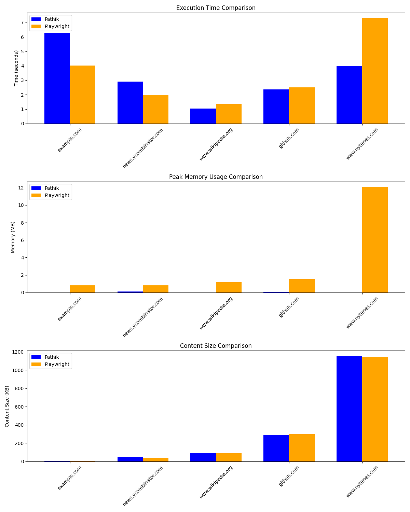

<p align="center">
  
</p>

<h1 align="center"><b>Pathik (पथिक)</b></h1>

# 🛤️ **Pathik - High-Performance Web Crawler** ⚡

## **Introduction**
Pathik (पथिक) is the Sanskrit word for **traveler** or **one who follows a path**. Just as a traveler navigates vast terrains efficiently, **Pathik is a blazing-fast web crawler that maps the digital world with speed and precision.** 🚀

A powerful, memory-efficient web crawling tool with **Go implementation and Python bindings**, designed for high-performance web scraping. Pathik supports **local storage** and optional **Cloudflare R2 storage** for seamless scalability.

## **⚡ Performance Benefits**

### **Memory Efficiency**
Unlike browser-based scraping tools like Playwright, Pathik operates with minimal memory overhead, making it ideal for large-scale crawling or resource-constrained environments.

### **Speed Advantages**
Pathik outperforms Playwright when crawling large websites:
- **Faster page processing and navigation**
- **Efficient parallel crawling** for maximum throughput
- **Optimized resource handling** to reduce overhead

These improvements stem from Pathik's **Go-powered crawler core**, which avoids the memory-heavy footprint of full browser automation.

<!--  -->

---

## 🚀 **Installation**

### **Prerequisites**
- Go 1.16+
- Python 3.6+

### **Install Python Package**
```sh
pip install pathik
```

### **Clone Repository**
```sh
git clone https://github.com/yourusername/pathik.git
cd pathik
```

### **Install in Development Mode**
```sh
pip install -e .
```

---

## 🔧 **Building the Go Binary**

### **Navigate to Pathik Directory**
```sh
cd pathik
```

### **Build Binary Using Script**
```sh
python build_binary.py
```

### **Expected Output:**
```
Building Go binary in /path/to/pathik
Build successful!
Binary located at: /path/to/pathik/pathik_bin
Testing binary...
Binary output: [Help text from binary]
```

---

## 🔍 **Usage**

### **Python Usage**

#### **Basic Crawling**
```python
import pathik
import os

output_dir = os.path.abspath("output_data")
os.makedirs(output_dir, exist_ok=True)

urls = ["https://example.com"]
results = pathik.crawl(urls, output_dir)

for url, files in results.items():
    print(f"URL: {url}")
    print(f"HTML: {files['html']}")
    print(f"Markdown: {files['markdown']}")
```

#### **R2 Upload (Optional)**
```python
results = pathik.crawl_to_r2(
    ["https://example.com"],
    uuid_str="my-id"
)

for url, info in results.items():
    print(f"R2 HTML Key: {info['r2_html_key']}")
    print(f"Local File: {info['local_html_file']}")
```

### **Direct Go Usage**

#### **Local Crawling**
```sh
./pathik_bin -crawl -outdir ./output https://example.com
```

#### **R2 Upload**
```sh
./pathik_bin -r2 -uuid my-id -dir ./output https://example.com
```

---

## **JavaScript Usage (Node.js / Bun)**

Pathik can also be used in **JavaScript** or **TypeScript** environments, including **Node.js** and **Bun**.

### **Installation**

#### **Using Bun**:
```bash
bun i pathik
# or global install
bun -g pathik
```

#### **Using npm**:
```bash
npm install pathik
```

### **Basic Crawling**
Below is an example of how you can use Pathik in JavaScript to crawl a URL. For more details, see [basic.js](pathik-js/examples/basic.js) in this repository.

```js
import { crawl } from 'pathik';

(async () => {
  const outputDir = './output';
  const urls = [ 'https://example.com' ];

  // Crawl the given URLs and store results locally
  const results = await crawl(urls, outputDir);

  for (const [url, files] of Object.entries(results)) {
    console.log(`URL: ${url}`);
    console.log(`HTML: ${files.html}`);
    console.log(`Markdown: ${files.markdown}`);
  }
})();
```

### **CLI Usage** (Bun / Node)
After installing globally (via **bun -g pathik** or **npm i -g pathik**), you can crawl URLs with one command:

```bash
pathik crawl https://example.com -o ./output
```

---

## 🛠️ **Troubleshooting**

### **Missing Binary**
```sh
cd pathik
python build_binary.py
```

### **Path Issues**
```python
# Use absolute paths
output_dir = os.path.abspath("./output")
```

### **Import Errors**
```sh
pip uninstall -y pathik
cd pathik && pip install -e .
```

---

## 🏗️ **Project Structure**
- `main.go` - CLI interface
- `crawler/` - Web crawling logic
- `storage/` - File storage handlers
- `pathik/` - Python bindings
- `__init__.py` - Package setup
- `crawler.py` - Go integration
- `simple.py` - Python fallback

---

## ⚙️ **Configuration**

Configure R2 credentials in `storage.go` or through environment variables.

---

## 📜 **License**
**Apache 2 License**

🌟 **Pathik - Navigate the web with precision and speed!** 🌟

